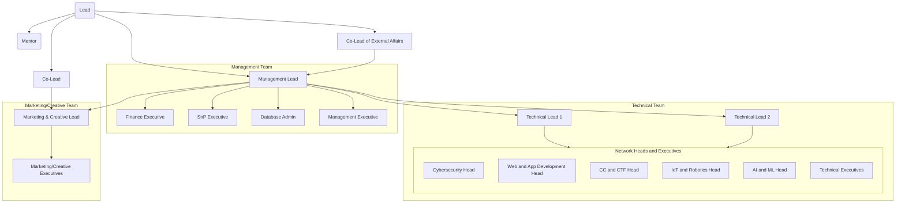

## Council Structure Elaboration

The council structure depicted in the flowchart outlines the hierarchical structure of Google DG, with a focus on leadership roles and reporting relationships. 

### Leadership Roles and Responsibilities:

- **Lead**: The overall leader responsible for the strategic direction and performance of the council.

- **Co-Lead**: Assists the Lead in leadership responsibilities and may oversee specific areas of focus within the council(Technical or Marketing).

- **Co-Lead of External Affairs**: Responsible for managing relations with external bodies such as Google, other clubs, and the Student Council. This role also includes coordinating external events in collaboration with our university.

- **Management Lead**: Responsible for managing the overall operations and coordination of different teams within the council. Some responsibilities include:
    - Strategic planning and goal setting.
    - Overseeing team performance and ensuring alignment with organizational objectives.
    - Acting as a liaison between different teams and stakeholders.

- **Mentors**: Responsible for keeping the Administrative Structure in Check, Advising the Lead and the Co-Lead in overall club management.
  - Helping the council technically and managerially when needed and keeping the systems and procedures in check.

- **Technical Lead**: Responsible for technical aspects of the council's operations, including:
    - Leading technical projects and initiatives.
    - Ensuring the reliability and security of technical systems.
    - Providing technical guidance and support to team members.
    - Planning for competitions and technical workshops and bootcamps

- **Marketing/Creative Lead**: Oversees marketing strategies and initiatives, and is responsible for guiding the creative direction and output of the council. Their responsibilities are as follows:
    - Developing marketing campaigns to promote the council's activities or services.
    - Conducting active research and gaining insights into the councils marketing efforts.
    - Managing branding and communication efforts.
    - Learning design and content creation efforts.
    - Ensuring consistency and quality in visual materials.
    - Collaborating with other team sto integrate creative elements into projects.
 
### Teams

- **Management Team**
    - Management Lead
    - Finance Executive
    - SnP Executive
    - DB Executive
    - Management Executive
 
- **Technical Team**
    - Technical Head
    - Cybersecurity Head
    - Web and App Development Head
    - CC and CTF Head
    - IoT and Robotics Head
    - AI and ML Head
    - Technical Executives

- **Marketing/Creative Team**
    - Marketing/Creative Head
    - Marketing/Creative Executives

### Reporting Structure:

- Each lead (Technical, Marketing, Creative, Finance) has a team reporting directly to them, responsible for executing tasks and projects within their respective domains.

- The Management/Events Team reports directly to the Management Lead and handles management-related tasks and event planning/execution.

### Additional Roles and Responsibilities:

- **Technical Executive & Network Leads**: Senior technical personnel responsible for overseeing specific technical domains or networks within the council.

- **Marketing Manager & Executives**: Support the Marketing Lead in executing marketing strategies and campaigns, comprising managers and executives with specialized roles in graphics and video respectively.

- **Creative Managers & Executives**: Assist the Creative Lead in managing creative projects and outputs, comprising managers and executives with expertise in design and content creation.

- **Finance Executive**: Budget planning and management, financial reporting and analysis, ensuring compliance with financial regulations and policies set by the Lead, Google DG, and the University. Also looks into membership structure and pricing structure, collect payments and interactive with fee related issues with members.

- **SnP Executive & Database Systems Admin**: Specialized roles within the Management/Events Team, responsible for _Standards and Procuedures_ aka Quality Assurance and _Database administration_ aka Managing the GDSC Database.
---

# Job Decriptions

**SnP Executive**: Responsible for maintaining the Standards and Procedures of the Council Operations, Quality Check, Introduce and Optimize New or Existing Systems and Procedures, Automation of repeated tasks and Introduce Robust Tasks.

- Will report to the Lead, Co-Lead and Management Lead

**Database Systems Admin**: Responsible for ensuring continuous development and maintainence of GDSC Database (Google Sheets, Task Tracker, GDSC Website, GDSC ERP).

- Also expected to continously build automation systems, Dashbaords and Internal Tools.

**Technical Executive**: Conduct workshops on their field of experiance, Continuously learn new technologies and make questions for competitions and hackathons conducted by GDSC.

- Also respnsible for handling technical aspects of workshops conducted by GDSC.
- Preparing workshop documentation and actively reviewing documentation for other's workshops.

**Marketing Executive**: Resonsible for coming up with ideas to market events(Workshops/Competitions/Hackathons/Membership Drives) and implement them using the help of creative and events team.
- Also responsible for coming up with new initiatives to improve engagement and ommunication with community members.

> This structure was developed by Mohammed Husamuddin (Lead of Google DSC 2023-2024) from experiance and active experimentation. It has been updated since then by Nishit Batwal (Lead of Google DG 2024-2025).

  ==The Documentation is Subject to Change upon the Leads Decision; This documentation has been compiled through experiance and experimentation, and is the official documentation and procedures compiled by Mohammed Husamuddin and maintained by Sivaa B in 2023==

