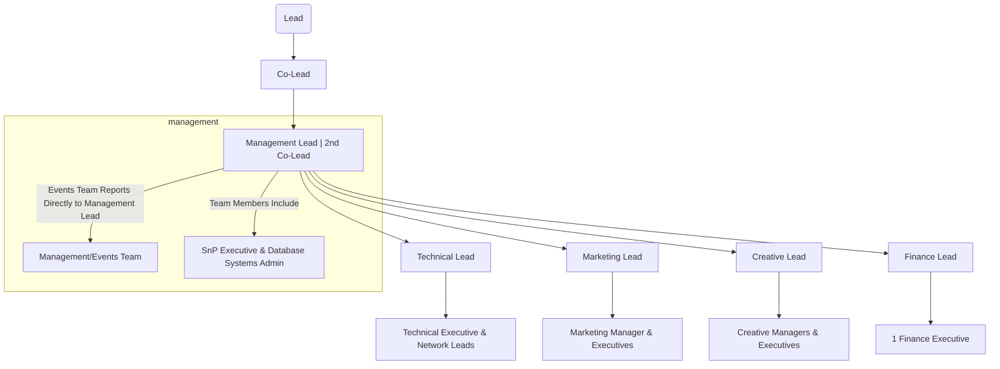

```mermaid
flowchart TD
    A("Lead") --> B["Co-Lead"]
    B --> C["Management Lead | 2nd Co-Lead"]
    C-->D["Technical Lead"]
    C-->E["Marketing Lead"]
    C-->F["Creative Lead"]
    C-->G["Finance Lead"]
    

    D-->T["Technical Executive & Network Leads"] 
    E-->M["Marketing Manager & Executives"]
    F-->P["Creative Managers & Executives"]
    G-->H["1 Finance Executive"]
    subgraph management
        direction LR
        C-->|Events Team Reports Directly to Management Lead | I["Management/Events Team"]
        C-->| Team Members Include | EX["SnP Executive & Database Systems Admin"]
    end
```
