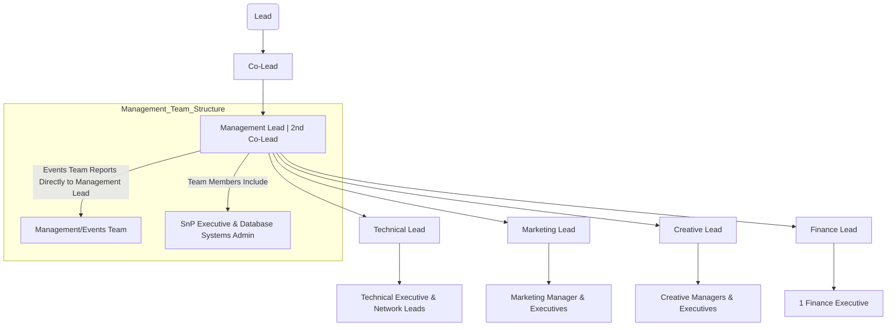

## Council Structure Elaboration

The council structure depicted in the flowchart outlines the hierarchical organization of a team or department, with a focus on leadership roles and reporting relationships. Here's a detailed breakdown:

### Leadership Roles and Responsibilities:

- **Lead (A)**: The overall leader responsible for the strategic direction and performance of the council.

- **Co-Lead (B)**: Assists the Lead in leadership responsibilities and may oversee specific areas of focus within the council.

- **Management Lead | 2nd Co-Lead (C)**: Responsible for managing the overall operations and coordination of different teams within the council. Some responsibilities include:
  - Strategic planning and goal setting.
  - Overseeing team performance and ensuring alignment with organizational objectives.
  - Acting as a liaison between different teams and stakeholders.

- **Technical Lead (D)**: Responsible for technical aspects of the council's operations, including:
  - Leading technical projects and initiatives.
  - Ensuring the reliability and security of technical systems.
  - Providing technical guidance and support to team members.

- **Marketing Lead (E)**: Oversees marketing strategies and initiatives, including:
  - Developing marketing campaigns to promote the council's activities or services.
  - Conducting market research and analysis to identify opportunities.
  - Managing branding and communication efforts.

- **Creative Lead (F)**: Responsible for guiding the creative direction and output of the council, such as:
  - Leading design and content creation efforts.
  - Ensuring consistency and quality in visual materials.
  - Collaborating with other teams to integrate creative elements into projects.

- **Finance Lead (G)**: Manages financial matters within the council, including:
  - Budget planning and management.
  - Financial reporting and analysis.
  - Ensuring compliance with financial regulations and policies.

### Reporting Structure:

- Each lead (Technical, Marketing, Creative, Finance) has a team reporting directly to them, responsible for executing tasks and projects within their respective domains.

- The Management/Events Team (I) reports directly to the Management Lead (C) and handles management-related tasks and event planning/execution.

### Additional Roles and Responsibilities:

- **Technical Executive & Network Leads (T)**: Senior technical personnel responsible for overseeing specific technical domains or networks within the council.

- **Marketing Manager & Executives (M)**: Support the Marketing Lead in executing marketing strategies and campaigns, comprising managers and executives with specialized roles.

- **Creative Managers & Executives (P)**: Assist the Creative Lead in managing creative projects and outputs, comprising managers and executives with expertise in design and content creation.

- **1 Finance Executive (H)**: Assists the Finance Lead in managing financial matters within the council, handling day-to-day financial operations and reporting.

- **SnP Executive & Database Systems Admin (EX)**: Specialized roles within the Management/Events Team, responsible for logistics (SnP) and database administration.

