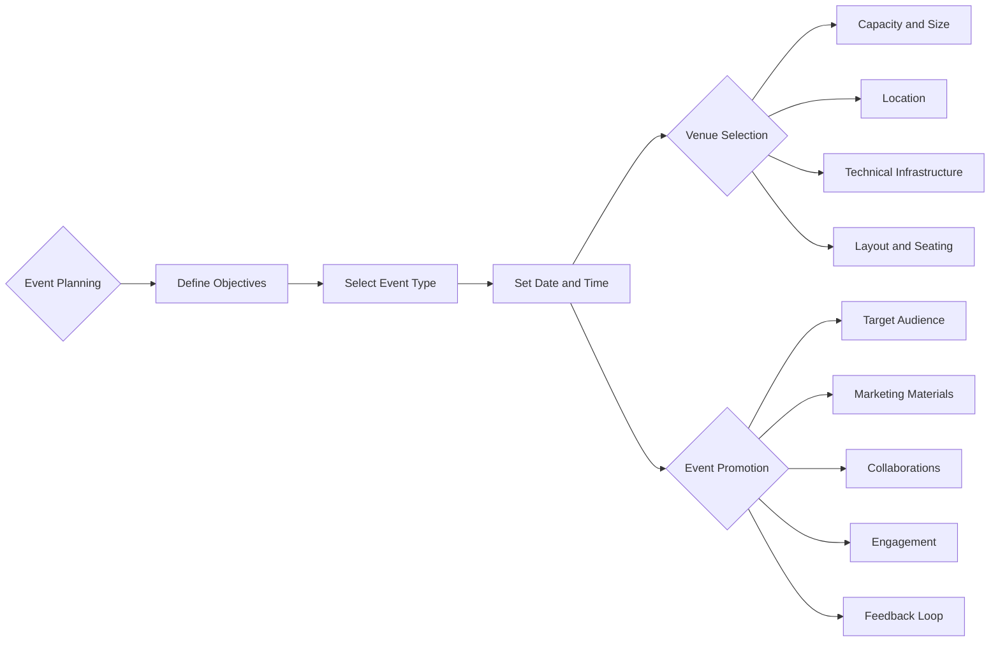

# Event Planning Guidelines for GDSC BITS Pilani Dubai Campus

Welcome to the Event Planning Guidelines for GDSC BITS Pilani Dubai Campus! This comprehensive guide will help you organize successful and memorable events for our community. Remember that all workshops and their documentation should be prepared in Markdown for easy upload to GDSC's website.

## Event Logistics

### Planning

#### Steps for Planning an Event

1. **Define Objectives**: Clearly define the event's goals, purpose, and target audience. Determine what you aim to achieve through the event.

2. **Select Event Type**: Decide on the type of event, whether it's a workshop, hackathon, seminar, or social gathering. The format should align with your objectives.

3. **Set Date and Time**: Choose a suitable date and time, considering the availability of your target audience and key speakers or presenters.

4. **Venue Selection**: Refer to the Venue Selection section below for detailed instructions.

5. **Budgeting**: Refer to the Budgeting section below for detailed instructions.

6. **Event Promotion**: Refer to the Event Promotion section below for detailed instructions.

### Venue Selection

#### How to Select a Venue

1. **Capacity and Size**: Assess the expected number of attendees and choose a venue that comfortably accommodates them. Ensure it's not too large to avoid a sparse atmosphere or too small to risk overcrowding.

2. **Location**: Select a location that is convenient for your target audience. Consider accessibility via public transportation and parking availability.

3. **Technical Infrastructure**: Ensure the venue has the necessary technical infrastructure, such as internet access, audiovisual equipment, and power outlets, to support your event's requirements.

4. **Layout and Seating**: Plan the layout and seating arrangement to facilitate networking, engagement, and interaction among attendees.

5. **Accessibility**: Confirm that the venue is accessible to individuals with disabilities and meets all safety and regulatory requirements.

6. **Cost**: Evaluate the cost of the venue and negotiate if possible to stay within your budget.

### Budgeting

#### How to Budget for an Event

1. **Expense Categories**: Create a detailed list of all potential expenses, including venue rental, catering, promotional materials, speaker fees, and miscellaneous costs.

2. **Revenue Sources**: Identify potential revenue sources, such as ticket sales, sponsorships, or contributions from your organization.

3. **Budget Allocation**: Allocate your budget to each expense category, ensuring that you prioritize essential elements while staying within your budget constraints.

4. **Contingency Fund**: Set aside a contingency fund for unforeseen expenses or emergencies.

5. **Tracking**: Maintain a record of all expenses and income related to the event. Use a spreadsheet or budgeting software for accurate tracking.

6. **Regular Reviews**: Periodically review and update your budget to ensure you are on track and make adjustments if needed.

### Event Promotion

#### How to Promote an Event

1. **Target Audience**: Identify your target audience and tailor your promotional efforts to reach them effectively.

2. **Marketing Materials**: Create eye-catching marketing materials, including posters, flyers, and digital graphics. Use consistent branding elements.

3. **Online Promotion**: Utilize social media platforms, email newsletters, and your website to promote the event. Leverage GDSC's website for event documentation.

4. **Collaborations**: Partner with relevant organizations, influencers, or speakers to expand your reach and credibility.

5. **Early Bird Tickets**: Offer early bird tickets or discounts to incentivize early registrations (Only for specific events; Otherwise we have the standard non-member fees).

6. **Engagement**: Engage with your audience through engaging content, sneak peeks, and teasers leading up to the event.

7. **Feedback Loop**: Encourage feedback from attendees and use it to improve future events.

By following these extensive and self-explanatory event planning guidelines, you will be well-prepared to organize successful events that benefit the GDSC community.

